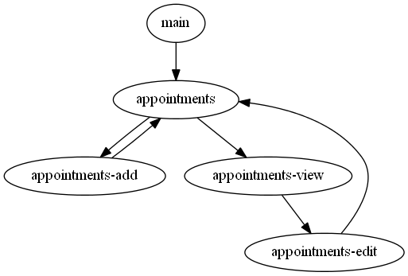

# hackathon-2016

This is the demonstration we could show at the Geneva Hackathon 2016.
You can [see the result here](http://tolokoban.github.io/hackathon-2016/#main).

# Example from the story point of view

Follows an example of story and how it is implemented with action files.

> May 1, 2016 - 15:30  
> Kilian Jornet is running in the mountain.  
> But suddenly, he falls and sprains his right ankle.  
> He returns in his car with a limp.  
> He launches the APP.


```js
// File: "s1-start.js"
['story', [
  // `reset` means that you want fresh data in the APP.
  ['reset', {
    'info.firstname': 'Kilian',
    'info.lastname': 'JORNET',
    // Let's define an empty list of appointments.
    appointments: [],
    // Data starting with a `$` are demo specific.
    // `$today` is used to set to current datetime of the current action.
    // Internally, dates have this format: YYYYMMDDhhmm
    $today: 201605011530,
    // `$next` is the action to take when the APP is closed.
    $next: "s1-back-to-home"
  }],
  // `text` is free HTML.
  // Double curlies are used to insert data.
  // `|datetime` format a date in a human readable way.
  ['text', '<b>{{today|datetime}}</b>'],
  ['text', '{{info.firstname}} {{info.lastname}} is running in the mountain.'],
  ['text', 'But suddenly, he falls and sprains his right ankle.'],
  ['text', 'He returns in his car with a limp.'],
  ['button', { text: 'He launches the APP', action: 'app' }],
]]
```

We don't describe here the `app.js` file which is about the APP. Just focus on the story point of view.

> May 1, 2016 - 17:45  
> Kilian call his doctor and get an appointment for tomorrow 9:00 AM.
> He registers this appointment in his APP.

```js
['story', [
  // Using `set` instead of `reset` will add new data, but doesn't reset the existing data.
  ['set', {
    $today: 201605011745,
    $next: "s1-next"
  }],
  ['text', '<b>{{today|datetime}}</b>'],
  ['text', '{{info.firstname}}  call his doctor and get an appointment for tomorrow 9:00 AM.'],
  ['button', { text: "He registers this appointment in his APP.", action: 'app' }]
]]
```

That's all that need to be known for story makers.

# Example from the APP point of view

Working on the APP part is similar to the work on the STORY part.
But relationships between actions can be more complex.

Here is an example of management of a list of appointments. The following schema shows these relationships.




## Prerequisites

First of all you need to install this:
* A repository manager: [git](https://git-scm.com/)
* A off-browser javascript runner: [nodejs](https://nodejs.org/en/) (the LTS version)
* A Apache/PHP solution: [wamp](http://www.wampserver.com/en/) (for Windows users)
 
## Setting up your environment

You need to use the command line. On Linux it is obvious, in Windows, you can use the __Git Bash__ that comes with `git`.
Then open a terminal, go to your working forlder and type this:

```
git clone https://github.com/tolokoban/hackathon-2016.git hackathon-2016
cd hackathon-2016
npm update
```

Now, you are in the new directory that has been created:

You will find the file `package.json` in this folder. Edit it and change the following line:

```
    "output": "../../www/hackathon"
```

Replace `../../www/hackathon` with the path of the root of your Apache/PHP server. If you use _wamp_, dig into its installation folder and look for a file called `index.html`. This is the directory of `index.html` that you should use as `output` value.

## Compile the project

To start the continue compilation process, just open a terminal, go in the `hackathon-2016` directory and type:

```
npm run debug
```

Now you start working on the sources and view the result in a browser at this URL: [http://localhost/]

